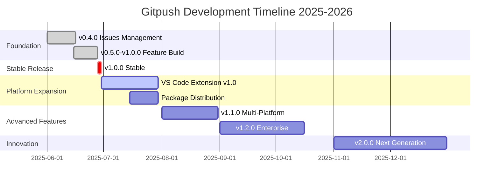

# gitpush Roadmap 2025-2026

> The evolution of Git workflow automation - from CLI script to comprehensive development platform

---

## 🎯 Vision Statement

Transform gitpush into the **de facto standard** for intelligent Git workflow automation, providing developers and teams with AI-powered tools that make Git operations smarter, faster, and more collaborative.

---

## 📅 Updated Timeline (June 2025)



---

## 🏆 Current Status (June 28, 2025)

### ✅ **Completed (v1.0.0-beta → v1.0.0)**
- **AI Integration**: Multi-provider support (OpenAI, Anthropic, Google, Ollama)
- **Team Collaboration**: Shared workflows, statistics, notifications
- **Plugin System**: Extensible architecture with hooks
- **Desktop GUI**: Electron-based application foundation
- **Comprehensive Testing**: 94% test coverage, automated CI/CD
- **Professional Documentation**: Complete guides and troubleshooting

### 🔄 **In Progress**
- **v1.0.0 Stable Release**: Final polish and production deployment
- **Cross-platform Testing**: macOS, Linux, WSL validation
- **Performance Optimization**: Speed and memory improvements

---

## 🚀 Release Timeline

### 📦 **v1.0.0 Stable** - June 28, 2025
**Status**: 🔄 **In Progress** (Release Candidate)

#### ✅ Completed Features
- **Complete AI Workflow**: Smart commits, code review, conflict resolution
- **Advanced Issue Management**: GitHub integration with auto-linking
- **Team Analytics**: Productivity metrics and collaboration insights
- **Plugin Ecosystem**: Extensible architecture with community plugins
- **Desktop Application**: Cross-platform GUI foundation
- **Enterprise Ready**: Security, performance, scalability

#### 🎯 Release Goals
- **Production Stability**: Zero critical bugs, comprehensive error handling
- **Professional Documentation**: Complete user and developer guides
- **Distribution Ready**: Package managers, one-click install
- **Community Foundation**: Contribution guidelines, issue templates

---

### 🎨 **v1.1.0 - VS Code Extension** - July 30, 2025
**Status**: 📋 **Planned** (Next Sprint)

#### 🎯 Core Features
- **Seamless Integration**: AI commits directly in VS Code
- **Visual Issue Management**: Create and manage GitHub issues from editor
- **Real-time Analytics**: Productivity dashboard in sidebar
- **Smart Suggestions**: Context-aware Git operations
- **Team Collaboration**: Shared workflows and templates

#### 📈 Success Metrics
- **10,000+ installs** in first month
- **4.5+ stars** on VS Code Marketplace
- **Active community** feedback and contributions

#### 🛠️ Technical Implementation
```typescript
// VS Code Extension Architecture
gitpush-vscode/
├── src/
│   ├── extension.ts        # Main extension entry
│   ├── commands/           # Command implementations
│   ├── providers/          # AI and GitHub integrations
│   ├── views/              # Sidebar and webviews
│   └── utils/              # Shared utilities
├── media/                  # Icons and assets
└── package.json           # Extension manifest
```

---

### 📦 **v1.2.0 - Package Distribution** - August 15, 2025
**Status**: 📋 **Planned**

#### 🎯 Distribution Targets
- **Homebrew** (macOS): `brew install gitpush`
- **APT** (Ubuntu/Debian): `sudo apt install gitpush`
- **Snap** (Universal Linux): `snap install gitpush`
- **Chocolatey** (Windows): `choco install gitpush`
- **NPM** (Global): `npm install -g gitpush`

#### 📋 Requirements
- **Automated packaging** for all platforms
- **Digital signatures** and security validation
- **Auto-update mechanisms** for seamless upgrades
- **Uninstall cleanup** scripts

---

### 🌐 **v1.3.0 - Multi-Platform Support** - September 30, 2025
**Status**: 💡 **Future**

#### 🎯 Platform Expansion
- **GitLab Integration**: Complete feature parity with GitHub
- **Bitbucket Support**: Repository management and CI/CD
- **Azure DevOps**: Enterprise integration capabilities
- **Self-hosted Git**: Generic Git server compatibility

#### 🔧 Technical Challenges
- **Unified API abstraction** across platforms
- **Authentication management** for multiple services
- **Feature detection** and graceful degradation
- **Cross-platform testing** automation

---

### 🏢 **v1.4.0 - Enterprise Features** - November 15, 2025
**Status**: 💡 **Future**

#### 🎯 Enterprise Capabilities
- **SSO Integration**: SAML, OIDC, Active Directory
- **Audit Logging**: Comprehensive activity tracking
- **Role-based Access**: Granular permission management
- **Compliance**: SOC 2, GDPR, HIPAA readiness
- **On-premise Deployment**: Air-gapped environments

#### 💼 Business Model
- **Free Tier**: Individual developers, open source
- **Pro Tier**: $9/month - Advanced AI, team features
- **Enterprise**: $49/user/month - Full feature set, support

---

### 🚀 **v2.0.0 - Next Generation Platform** - Q1 2026
**Status**: 🔮 **Vision**

#### 🌟 Revolutionary Features
- **AI Code Generation**: Beyond commits to actual code
- **Predictive Workflows**: ML-powered development insights
- **Mobile Companion**: iOS/Android apps for on-the-go management
- **Voice Interface**: Natural language Git commands
- **AR/VR Integration**: Immersive code visualization

#### 🎯 Platform Goals
- **1M+ active users** worldwide
- **50+ supported platforms** and integrations
- **Developer ecosystem** with 100+ community plugins
- **Industry recognition** as the Git automation standard

---

## 🎯 Success Metrics

### 📊 **Adoption Targets**

| Milestone | Target Date | Users | Revenue (ARR) |
|-----------|-------------|-------|---------------|
| v1.0.0 Launch | July 2025 | 5,000 | $0 |
| VS Code Extension | August 2025 | 25,000 | $10K |
| Enterprise Beta | October 2025 | 50,000 | $100K |
| v2.0.0 Launch | March 2026 | 200,000 | $1M |

### 🏆 **Quality Metrics**
- **Test Coverage**: Maintain >95%
- **Performance**: <100ms startup time
- **Reliability**: 99.9% uptime for SaaS features
- **Security**: Zero critical vulnerabilities
- **User Satisfaction**: 4.8+ stars across all platforms

---

## 🤝 Community & Ecosystem

### 👥 **Community Building**
- **Developer Advocacy**: Conference talks, blog posts, tutorials
- **Open Source Contributions**: Hacktoberfest participation
- **Educational Content**: YouTube channel, documentation
- **Community Forums**: Discord, GitHub Discussions

### 🔌 **Plugin Ecosystem**
- **Plugin Marketplace**: Centralized discovery and distribution
- **Developer Tools**: Plugin SDK, testing framework
- **Revenue Sharing**: 70/30 split for paid plugins
- **Quality Standards**: Review process and certification

### 🎓 **Educational Initiatives**
- **Git Mastery Course**: Interactive learning platform
- **Best Practices Guide**: Industry-standard workflows
- **Certification Program**: gitpush expert credentials
- **University Partnerships**: CS curriculum integration

---

## 🔬 Research & Innovation

### 🧠 **AI Research Areas**
- **Code Understanding**: Semantic analysis of changes
- **Predictive Modeling**: Anticipate conflicts and issues
- **Natural Language**: Conversational Git interactions
- **Automated Testing**: AI-generated test cases

### 🔍 **Emerging Technologies**
- **WebAssembly**: Browser-based Git operations
- **Blockchain**: Decentralized code verification
- **Quantum Computing**: Advanced cryptographic signatures
- **Edge Computing**: Offline-first AI capabilities

---

## 📞 Strategic Partnerships

### 🏢 **Technology Partners**
- **GitHub**: Enhanced platform integration
- **Microsoft**: Azure DevOps and VS Code collaboration
- **JetBrains**: IDE plugin development
- **Docker**: Container-based development workflows

### 🎓 **Educational Partners**
- **Universities**: Research collaboration and student programs
- **Bootcamps**: Curriculum integration and job placement
- **Online Platforms**: Course development and distribution

### 💼 **Enterprise Partners**
- **Consulting Firms**: Implementation and training services
- **System Integrators**: Custom enterprise solutions
- **Security Vendors**: Compliance and audit capabilities

---

## 📈 Marketing & Growth Strategy

### 🚀 **Go-to-Market**
- **Product Hunt Launch**: Major community announcement
- **Developer Conferences**: Live demos and presentations
- **Influencer Partnerships**: Tech YouTubers and bloggers
- **Content Marketing**: Technical blog posts and tutorials

### 📱 **Digital Presence**
- **Website**: Professional landing page and documentation
- **Social Media**: Twitter, LinkedIn, Dev.to presence
- **Email Marketing**: Developer newsletter and updates
- **SEO Strategy**: Rank for "Git automation" keywords

### 🎯 **Target Audiences**
1. **Individual Developers**: Productivity and workflow improvements
2. **Development Teams**: Collaboration and standardization
3. **DevOps Engineers**: CI/CD integration and automation
4. **Enterprise IT**: Security, compliance, and governance

---

## 💰 Business Model Evolution

### 🆓 **Open Source Foundation**
- **Core CLI**: Always free and open source
- **Community Plugins**: Free marketplace and distribution
- **Educational Use**: Completely free for students and educators

### 💎 **Premium Offerings**
- **Pro Features**: Advanced AI, team analytics, priority support
- **Enterprise Suite**: SSO, audit logs, custom integrations
- **Managed Service**: Hosted solution with SLA guarantees

### 🔄 **Revenue Streams**
1. **Subscription SaaS** (Primary): Monthly/annual recurring revenue
2. **Enterprise Licenses** (Secondary): Large organization deals
3. **Plugin Marketplace** (Future): Revenue sharing with developers
4. **Training & Consulting** (Services): Implementation support

---

**Last Updated**: June 28, 2025
**Next Review**: July 15, 2025
**Owner**: Karl Block & gitpush team

---

*This roadmap is a living document that evolves with community feedback, market demands, and technological opportunities.*