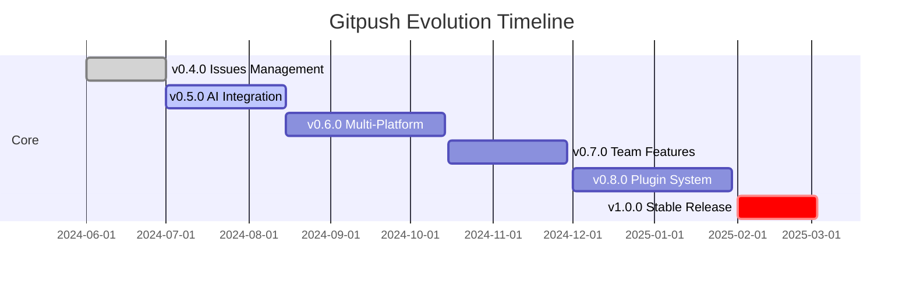

# 🗺️ GITPUSH ROADMAP 2024-2025

> La vision pour transformer gitpush en LA référence mondiale des outils Git

---

## 🎯 Vision
Faire de gitpush l'assistant Git/GitHub incontournable pour tous les développeurs, avec une expérience utilisateur exceptionnelle et une intelligence embarquée.

---

## 📅 Timeline Overview

---

## 🚀 Version Roadmap

### ✅ v0.4.0 - Issues Management (CURRENT)
- [x] Gestion complète des issues GitHub
- [x] Labels intelligents
- [x] Détection automatique dans les commits
- [x] Menu interactif dédié
- [x] Fermeture automatique via commits

### 🔥 v0.5.0 - AI-Powered Assistant (Juillet 2024)
**Objectif : Intelligence artificielle pour commits et workflow**

#### Features
- [ ] **AI Commit Messages**
  - Génération automatique basée sur les changements
  - Support GPT-4/Claude/Gemini
  - Apprentissage du style de l'équipe
  
- [ ] **Smart Code Review**
  - Suggestions pre-commit
  - Détection de patterns dangereux
  - Security scanning intégré

- [ ] **Intelligent Branching**
  - Noms de branches auto-générés
  - Stratégies de merge suggérées
  - Conflict prediction

#### Technical
- [ ] API abstraite pour multiples LLMs
- [ ] Mode offline avec modèle local
- [ ] Configuration par projet (.gitpush.ai)

### 🌍 v0.6.0 - Multi-Platform & GUI (Septembre 2024)
**Objectif : Accessibilité maximale**

#### Desktop App
- [ ] **Electron App**
  - Windows/Mac/Linux
  - System tray integration
  - Native notifications
  
- [ ] **GUI Features**
  - Visual commit builder
  - Drag & drop staging
  - Interactive rebase UI
  - Git graph visualization

#### Mobile Companion
- [ ] **Mobile App** (React Native)
  - View repo status
  - Quick commits
  - Issue management
  - Push notifications

#### Web Interface
- [ ] **Web Dashboard**
  - PWA support
  - Real-time sync
  - Team analytics
  - Browser extension

### 👥 v0.7.0 - Team Collaboration (Novembre 2024)
**Objectif : Fonctionnalités équipe et entreprise**

#### Features
- [ ] **Team Workflows**
  - Shared templates
  - Code review integration
  - Pair programming mode
  - Team statistics

- [ ] **Project Management**
  - Sprint integration
  - Burndown charts
  - Time tracking
  - Automated standups

- [ ] **Communication**
  - In-app messaging
  - Slack/Discord/Teams integration
  - Video call triggers
  - Code discussion threads

#### Enterprise
- [ ] SSO/SAML support
- [ ] Audit logs
- [ ] Compliance reports
- [ ] Private cloud deployment

### 🔌 v0.8.0 - Plugin Ecosystem (Janvier 2025)
**Objectif : Extensibilité infinie**

#### Plugin System
- [ ] **Plugin Architecture**
  - JavaScript/TypeScript SDK
  - Plugin marketplace
  - Auto-updates
  - Sandboxed execution

- [ ] **Core Plugins**
  - CI/CD integrations
  - Cloud providers
  - Testing frameworks
  - Documentation generators

- [ ] **Community**
  - Plugin development kit
  - Revenue sharing model
  - Featured plugins
  - Rating system

### 🎉 v1.0.0 - Production Ready (Mars 2025)
**Objectif : Stabilité et performance**

#### Stability
- [ ] 99.9% uptime guarantee
- [ ] Comprehensive test suite
- [ ] Performance benchmarks
- [ ] Security audit passed

#### Features Polish
- [ ] Onboarding wizard
- [ ] Interactive tutorials
- [ ] Multilingual (10+ languages)
- [ ] Accessibility (WCAG 2.1 AA)

#### Documentation
- [ ] Complete API docs
- [ ] Video tutorials
- [ ] Best practices guide
- [ ] Enterprise deployment guide

---

## 🔮 Future Ideas (v2.0+)

### 🤖 Advanced AI
- [ ] Code generation from issues
- [ ] Automated bug fixes
- [ ] Performance optimization suggestions
- [ ] Architecture recommendations

### 🌐 Blockchain Integration
- [ ] Decentralized code storage
- [ ] Contribution tokens
- [ ] Smart contract deployment
- [ ] NFT certificates for releases

### 🎮 Gamification
- [ ] Developer achievements
- [ ] Contribution streaks
- [ ] Team leaderboards
- [ ] Virtual rewards

### 🔒 Advanced Security
- [ ] Zero-knowledge proofs
- [ ] Encrypted repositories
- [ ] Compliance automation
- [ ] Vulnerability prediction

---

## 📊 Success Metrics

### User Adoption
- 2024 Q3: 1,000 active users
- 2024 Q4: 10,000 active users
- 2025 Q1: 50,000 active users
- 2025 Q2: 100,000+ active users

### Community
- 1000+ GitHub stars
- 100+ contributors
- 50+ plugins
- 10+ language translations

### Business
- Free tier: Unlimited for open source
- Pro tier: $9/month (teams)
- Enterprise: Custom pricing
- Plugin marketplace revenue share

---

## 🤝 How to Contribute

### Development
1. Check [CONTRIBUTING.md](CONTRIBUTING.md)
2. Pick an issue labeled `good-first-issue`
3. Join our Discord community
4. Submit PRs with tests

### Other Ways
- 📝 Documentation
- 🌍 Translations
- 🎨 UI/UX design
- 📹 Video tutorials
- 🐛 Bug reports
- 💡 Feature ideas

---

## 📞 Contact

- **Project Lead**: Karl Block
- **Email**: karl@gitpush.dev
- **Discord**: [Join Server](https://discord.gg/gitpush)
- **Twitter**: [@gitpushdev](https://twitter.com/gitpushdev)

---

## 📜 License

This roadmap is part of the gitpush project, licensed under MIT.

---

⭐ **Star us on GitHub to support the project!**

*Last updated: June 2024*